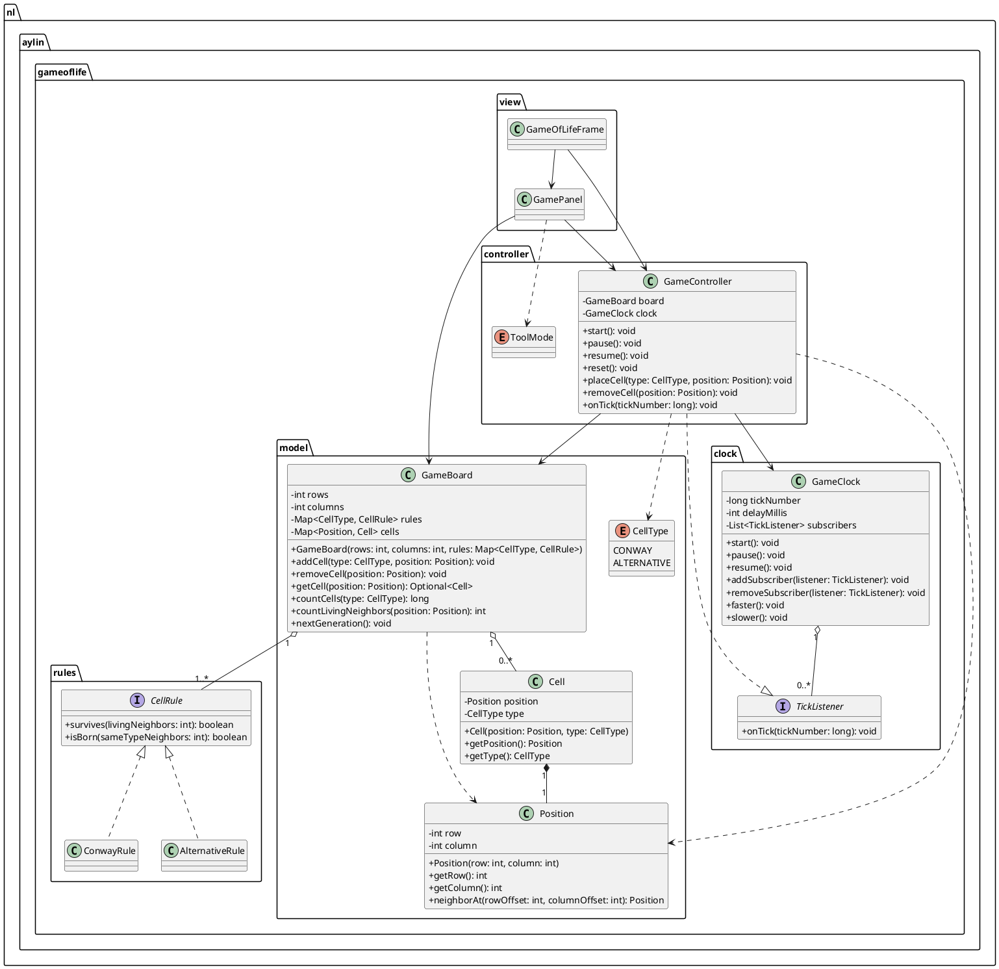

# UML-klassediagram

Je kunt deze PlantUML-code plakken in een PlantUML-viewer of in IntelliJ met een PlantUML-plugin.

## Patterns

- Observer pattern: `GameClock` beheert meerdere `TickListener`-subscribers en roept `onTick` aan.
- Strategy pattern: `GameBoard` bewaart per `CellType` een `CellRule`; `ConwayRule` en `AlternativeRule` bepalen polymorf welk gedrag geldt.
- Dependency injection: `GameBoard` kan via de constructor een andere `Map<CellType, CellRule>` krijgen, wat vooral in tests en uitbreidingen handig is.
- MVC: `model` bewaart en berekent de spelstatus, `view` tekent Swing-schermen, en `controller` vertaalt gebruikersacties/ticks naar model-acties.
